# AI Sales Rep - Website Analysis & Bot Training Tool

An intelligent website crawler that uses ChatGPT to analyze business websites and automatically create trained customer service bots using the Sensay platform.

## 🚀 Features

- **🎯 One-Command Full Demo**: Complete workflow from URL to interactive demo in one command
- **🧠 Smart Website Analysis**: Uses LLM to intelligently select relevant pages (FAQ, products, services, etc.)
- **📝 Business Knowledge Extraction**: Generates comprehensive business summaries from website content
- **🤖 Automatic Bot Training**: Creates and trains Sensay customer service bots with extracted knowledge
- **🌐 Interactive Demo Server**: Built-in demo server with responsive design showcases
- **📁 Organized Output**: Structured analysis results in company-specific folders

## ⚡ Quick Start

**Want to see it in action immediately?**
```bash
npm install
# Set your OPENAI_API_KEY and SENSAY_* credentials in .env
npm run full-demo -- https://example.com
```
This single command will crawl the website, create a bot, start a demo server, and open your browser to test it!

## 📋 Prerequisites

- Node.js 18+ installed
- OpenAI API key
- Sensay account and API credentials (optional, for bot creation)

## ⚙️ Installation

1. Clone the repository:
```bash
git clone https://github.com/sensay-io/ai-sales-rep.git
cd ai-sales-rep
```

2. Install dependencies:
```bash
npm install
```

3. Set up environment variables:
```bash
cp .env.template .env
```

Edit `.env` file with your credentials:
```env
# Required - OpenAI API Configuration
OPENAI_API_KEY=your_openai_api_key_here

# Optional - Sensay Configuration (for bot creation)
SENSAY_API_KEY=your_sensay_api_key_here
SENSAY_API_URL=https://api.sensay.io
SENSAY_ORGANIZATION_ID=your_organization_id
SENSAY_USER_ID=your_user_id
```

## 🔑 Getting Sensay Credentials

To create bots automatically, you'll need Sensay credentials:

1. **Get API Key**: Use the Sensay CLI or contact Sensay support
2. **Find Organization ID**: Available in your Sensay dashboard
3. **Find User ID**: Can be retrieved via Sensay API `/v1/users/me`

## 📖 Usage

### 🚀 Quick Start - Full Demo Workflow
**One command that does everything: crawl → create bot → start server → open browser**
```bash
npm run full-demo -- https://example.com
```
This will:
- Analyze the website and extract content
- Create a Sensay bot automatically  
- Start the demo server
- Open your browser to the interactive demo

### 📊 Website Analysis Only
```bash
npm run analyze -- https://example.com
```

### 🤖 Analysis + Bot Creation
```bash
npm run analyze-with-bot -- https://example.com
```

### 🌐 Demo Server Only
```bash
npm run demo-server
```
Then visit: `http://localhost:3005`

## 📁 Output Structure

After running the analysis, you'll get organized results:

```
analysis/
└── company-name/
    ├── company-name-knowledge-base.md     # LLM-generated business summary
    ├── company-name-raw-data.json         # Raw extracted data
    ├── company-name-sensay-bot.json       # Bot info (if created)
    └── sensay-training/                   # Sensay training data
        ├── system-message.txt             # Bot system prompt
        └── knowledge-base/                # Individual page files
            ├── homepage.md
            ├── products.md
            └── faq.md
```

## 🚀 How the Full Demo Works

The application follows a comprehensive 4-step workflow to transform any website into an intelligent customer service bot:

```mermaid
graph TD
    A[🌐 Input Website URL] --> B{📋 Sitemap Available?}
    B -->|Yes| C[🔍 Fetch sitemap.xml]
    B -->|No| D[🕷️ Crawl Website with Puppeteer]
    
    C --> E[📊 LLM URL Analysis - OpenAI API]
    D --> E
    
    E --> F[🎯 Select Relevant Pages<br/>Max 30 URLs → Max 15 URLs]
    F --> G[📄 Extract Page Content<br/>Cheerio + Content Processing]
    
    G --> H[🧠 LLM Business Analysis - OpenAI API]
    H --> I[💾 Generate Knowledge Base<br/>Markdown + Raw Data]
    
    I --> J{🤖 Create Bot?}
    J -->|Yes| K[🎨 Generate System Message - OpenAI API]
    J -->|No| Z[✅ Analysis Complete]
    
    K --> L[📝 Generate Questions - OpenAI API]
    L --> M[🚀 Create Sensay Bot - Sensay API]
    M --> N[📸 Capture Screenshots<br/>Puppeteer]
    N --> O[🎯 Generate Demo Page]
    O --> P[🌐 Start Demo Server<br/>Express.js]
    P --> Q[🚀 Open Browser]
    Q --> R[✅ Full Demo Complete]

    style A fill:#e1f5fe
    style E fill:#fff3e0
    style H fill:#fff3e0
    style K fill:#fff3e0
    style L fill:#fff3e0
    style M fill:#f3e5f5
    style N fill:#e8f5e8
    style P fill:#e8f5e8
    style R fill:#e8f5e8
```



### 🔧 Technical Architecture

#### API Calls & External Services:
1. **OpenAI API** (`src/website-analyzer.ts:118`, `src/analysis/llm-analyzer.ts:27`, `src/analysis/business-summarizer.ts:29`)
   - **Company Name Extraction**: Analyzes homepage content to extract brand name
   - **URL Analysis**: LLM selects most relevant pages from sitemap/crawled URLs
   - **Business Summarization**: Creates comprehensive business knowledge base
   - **System Message Generation**: Crafts intelligent bot personality and instructions
   - **Question Generation**: Creates suggested questions for bot testing

2. **Sensay API** (`src/sensay/bot-creator.ts:61`)
   - **Bot Creation**: Creates customer service bot with generated knowledge
   - **Authentication**: Uses organization API key and user credentials
   - **Model Configuration**: Deploys with GPT-4o and custom system message

3. **External Website APIs**:
   - **Sitemap Fetch**: HTTP requests to `/sitemap.xml` (`src/crawling/sitemap.ts:7`)
   - **Content Extraction**: HTTP requests to individual pages (`src/crawling/content-extractor.ts`)

#### LLM Usage Points:
- **Page Selection** (`src/analysis/llm-analyzer.ts`): Analyzes up to 50 URLs, returns max 15 relevant pages
- **Company Name Extraction** (`src/website-analyzer.ts:104`): Extracts brand name from homepage
- **Business Analysis** (`src/analysis/business-summarizer.ts`): Creates structured knowledge base
- **System Message** (`src/services/system-message.ts`): Generates bot personality and instructions  
- **Suggested Questions** (`src/output/markdown-generator.ts`): Creates demo questions

#### Web Scraping & Automation:
- **Puppeteer Integration**: Website crawling, screenshot capture, responsive design testing
- **Content Processing**: Cheerio for HTML parsing and content extraction
- **Sitemap Processing**: XML parsing for comprehensive URL discovery

### 🔄 Data Flow Process:

1. **Discovery Phase**: 
   - Sitemap parsing (`src/crawling/sitemap.ts`) or website crawling (`src/crawling/crawler.ts`)
   - URL filtering and relevance scoring

2. **Analysis Phase**:
   - Content extraction with Cheerio (`src/crawling/content-extractor.ts`)
   - LLM-powered page selection and business analysis
   - Knowledge base generation (`src/output/markdown-generator.ts`)

3. **Bot Creation Phase**:
   - System message generation (`src/services/system-message.ts`)
   - Sensay API integration (`src/sensay/bot-creator.ts`)  
   - Training data structuring (`src/services/training-data.ts`)

4. **Demonstration Phase**:
   - Screenshot capture (`src/crawling/crawler.ts:61`)
   - Demo page generation (`src/demo/demo-generator.ts`)
   - Express server hosting (`src/demo/server.ts`)

### 📊 Generated Outputs:

```
analysis/company-name/
├── company-name-knowledge-base.md     # LLM-generated business summary
├── company-name-raw-data.json         # Structured analysis data
├── company-name-sensay-bot.json       # Bot configuration & ID
├── demo/
│   ├── index.html                     # Interactive demo page
│   ├── screenshot-desktop.png         # Website screenshots
│   ├── screenshot-tablet.png
│   └── screenshot-mobile.png
└── sensay-training/
    ├── system-message.txt             # Bot personality prompt
    └── knowledge-base/                # Individual page content
        ├── homepage.md
        ├── products.md
        └── faq.md
```

## 🤖 Bot Training Process

### How It Works:
1. **Website Discovery**: Finds sitemap.xml or crawls website
2. **LLM Page Selection**: ChatGPT analyzes URLs and selects relevant pages
3. **Content Extraction**: Extracts clean content from selected pages
4. **Business Analysis**: LLM creates comprehensive business summary
5. **Bot Creation**: Automatically creates Sensay bot with company knowledge

### Generated Bot Features:
- **Smart System Prompt**: Incorporates all company knowledge
- **Professional Personality**: Configured for customer service
- **Knowledge Base**: Trained on products, services, FAQ, and policies
- **Company Context**: Understands business domain and offerings

## 🛠️ Advanced Configuration

### OpenAI Model Selection
```env
OPENAI_MODEL=gpt-4o-mini  # Default, cost-effective
# OPENAI_MODEL=gpt-4o     # More powerful, higher cost
```

### Custom API Endpoints
```env
OPENAI_BASE_URL=https://api.openai.com/v1  # Default
SENSAY_API_URL=https://api.sensay.io       # Default
```

## 📊 Example Workflows

### 🚀 Full Demo Workflow (Recommended)
```bash
# One command does everything!
npm run full-demo -- https://shopify.com

# Output:
# 📊 STEP 1: Website Analysis
# ✅ Found sitemap with 1,247 URLs
# ✅ LLM selected 12 relevant pages
# ✅ Analyzed 12 pages successfully
# 
# 🤖 STEP 2: Bot Creation  
# ✅ Business summary generated
# ✅ Sensay training data created
# ✅ Bot created: Shopify Customer Service Bot
#
# 🌐 STEP 3: Demo Server
# ✅ Demo server running: http://localhost:3005
#
# 🚀 STEP 4: Opening Demo
# ✅ Demo page opened: http://localhost:3005/demo/shopify-com
```

### 📊 Analysis Only
```bash
npm run analyze -- https://shopify.com
# Just creates analysis files without bot creation
```

### 🤖 Bot Creation Only  
```bash
npm run analyze-with-bot -- https://shopify.com
# Creates analysis + bot, but no demo server
```

### 📁 Check Results
```bash
ls analysis/shopify-com/
# shopify-com-knowledge-base.md
# shopify-com-raw-data.json  
# shopify-com-sensay-bot.json
# demo/
#   └── index.html
# sensay-training/
```

## 🔧 Development

### Build the project:
```bash
npm run build
```

### Run built version:
```bash
npm start https://example.com
```

## 📝 Generated Bot System Prompt

The tool creates intelligent system prompts like:

```
You are a customer service representative for Shopify (shopify.com). 
Your role is to help customers with their questions about our products, 
services, and policies.

Key Guidelines:
- Be helpful, professional, and friendly
- Provide accurate information based on the company knowledge base
- If you don't know something, admit it and offer to connect them with human support
- Stay focused on Shopify-related topics

Company Information:
**Homepage** (https://shopify.com)
Shopify is a commerce platform that lets you start, grow, and manage a business...

**Pricing** (https://shopify.com/pricing)
Choose the right plan for your business. Basic Shopify: $29/month...
```

## 🚀 Integration Options

### Manual Bot Training
If you prefer manual control, use the generated training data:
```bash
# Use generated files in: analysis/company-name/sensay-training/
# - system-message.txt: Copy to your bot's system prompt
# - knowledge-base/*.md: Upload as training documents
```

### API Integration
The tool can be integrated into larger workflows:
```typescript
import WebsiteAnalyzer from './src/index.js';

const analyzer = new WebsiteAnalyzer('https://example.com');
await analyzer.analyze();
await analyzer.saveResults('company-name', true); // Create bot
```

## 🎯 Best Practices

1. **Test with Small Sites First**: Start with smaller websites to understand output
2. **Review Generated Content**: Always review the knowledge base before deployment
3. **Customize System Prompts**: Edit generated prompts for your specific needs
4. **Monitor Bot Performance**: Test the created bot thoroughly
5. **Regular Updates**: Re-run analysis periodically to keep knowledge current

## 🤝 Contributing

1. Fork the repository
2. Create a feature branch
3. Make your changes
4. Submit a pull request

## 📄 License

MIT License - see LICENSE file for details

## 🆘 Support

- Create an issue for bugs or feature requests
- Check existing issues for solutions
- Contact the Sensay team for API-related questions

---

**Happy Bot Training! 🤖✨**